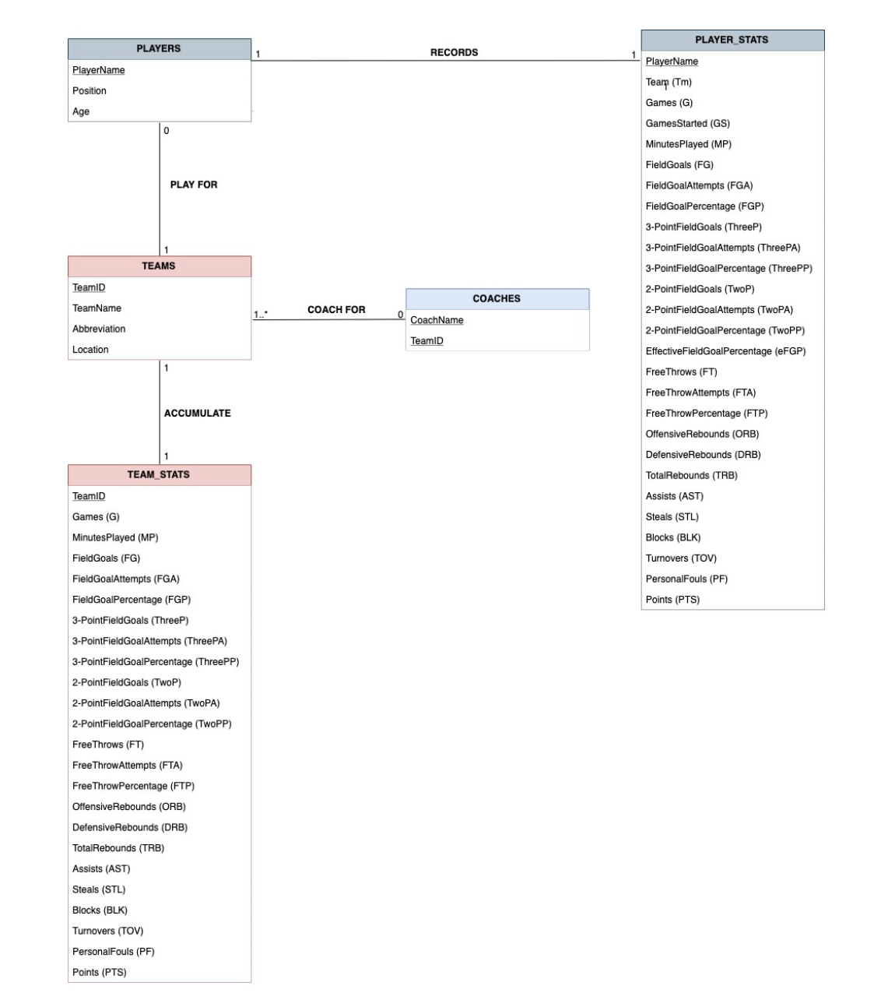
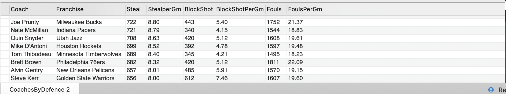
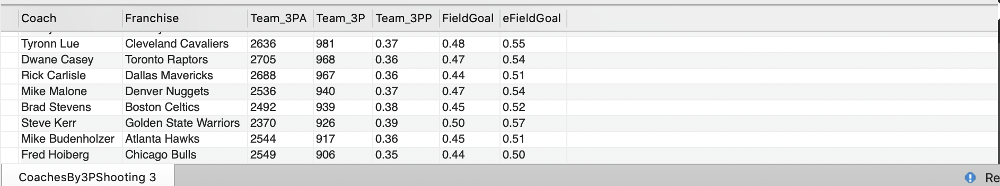
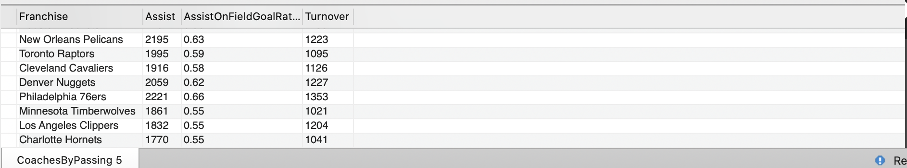
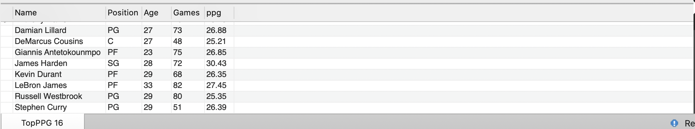
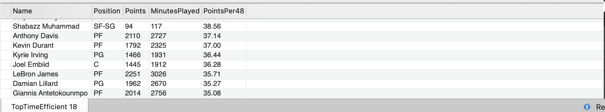
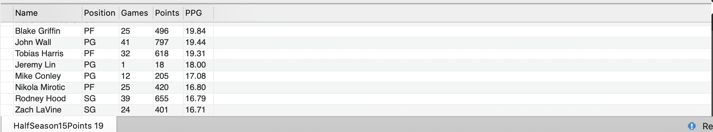

# Term_DE1  

## Project Description 

### OPERATIONAL LAYER: 

The data includes National Basketball Association (NBA) statistics for players, teams and coaches for 2017-2018 season. The relational database can be seen below. 

CSV files were used to store the raw data. Then a schema and tables were created with the same attributes as the CSV files. Finally, the data was inserted into MySQL using the following command 

* LOAD DATA 
* LOCAL INFILE 'path_to_csv_file'
* INTO TABLE 'corresponding_table'
* FIELDS TERMINATED BY ','
* LINES TERMINATED BY '\r\n'
* IGNORE 1 LINES 

### ANALYTICAL LAYER: 
After the tables were loaded to MySQL, the analytical data layer was established. Due to the fact that not all of the tables in the operationla layer can be related to each other, the decision to create two analytical tables was made. The tables are created using events which re-create them every minute for an hour and record the times of creation to a table called “messages”. Below is amore deatailed description for each of the created tables.  

1. Team_Coach_Analytic: includes information about teams such as the Franchise name, name abbreviation, city/state and the coach. In addition, it includes both defensive and offensive statistics. This can provide insight to team performance for he season, using both the already available data and trnformed data (e.g. assist on field goal percentage).
1. Players_Analytic: includes the players’ attributes such as name, age, position and franchise as well as individual performance metrics like games played. Data from this layer provides the opportunity to create more detailed analytic insight to see what player were major contributors to team performance. 

By creating views from the above data marts, we can potentially answer the following question. 

### ETL 

The process of ETL included the extraction of chosen metrics from the Aanlytical Layer, transformation by using arithmetic operations (where applicable), combibing the outcomes with readily available data and loading back to views which provide answers to the questions listed below. 

### POTENTIAL ANALYTICS:  

#### Team Level (Team_Coach_Analytic)

* Question 1: Who are the top 10 defensive coaches including. The view is ordered by steals, assuming steals are the ultimate goal of a tema on defence. 
* Question 2: What are the shooting patterns in terms of 3 point shooting and how it effects the Filed Goal and Effective Field Goal percentages? 
* Question 3: Which Coaches move the ball the most (assist on field goal ratio is over 0.5) and how it affects the turnovers? 

#### Player Level (Players_Analytic) 

* Question 1: Which players averaged over 25 points per game? 
* Question 2: Who was the most time (48 minutes) efficient scorer in the league? 
* Question 3: What players played less than or equal to half the season but scored over 15 points a game? 

### DATA MART: 

The following queries result in views that provide answers to the questions listed above.

#### Team Level 

* Question 1: SELECT * FROM CoachesByDefence;

* Question 2: SELECT * FROM CoachesBy3PShooting;

* Question 3: SELECT * FROM CoachesByAssist;

#### Individual Level 

* Question 1: SELECT * FROM TopPPG;

* Question 2: SELECT * FROM TopTimeEfficient;

* Question 3: SELECT * FROM HalfSeason15Points;

