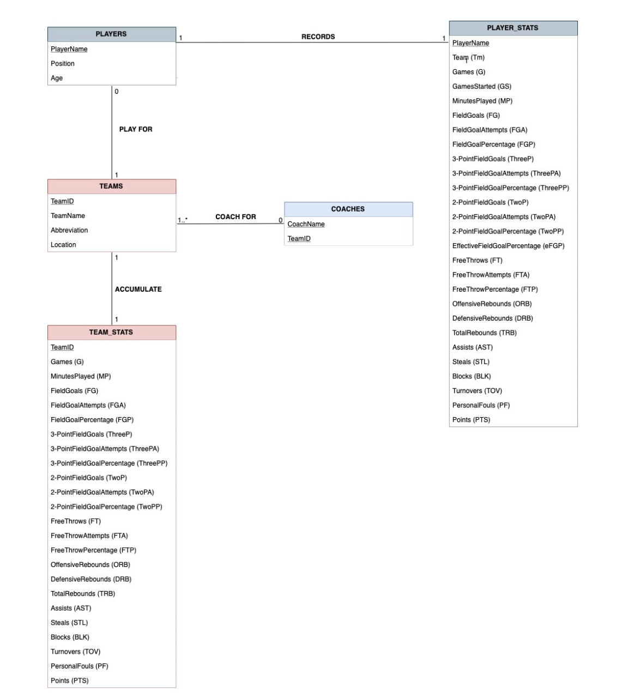
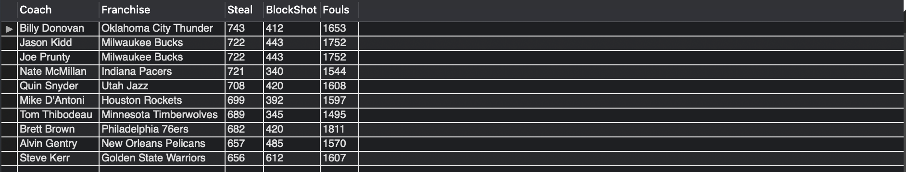
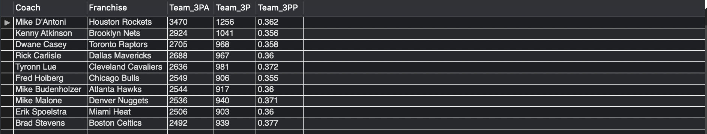
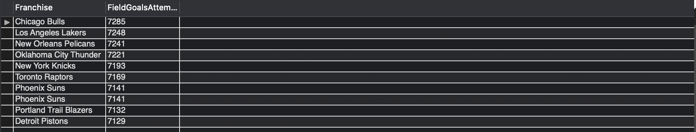
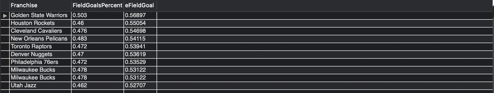
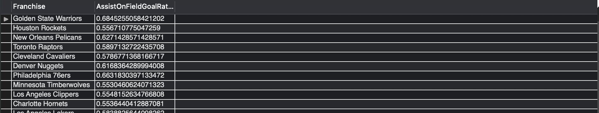
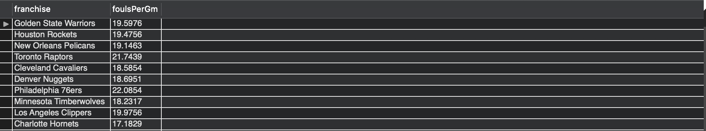
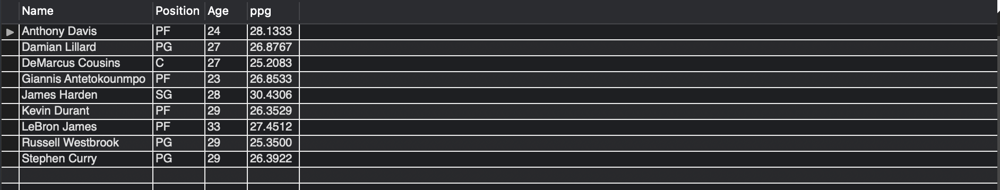
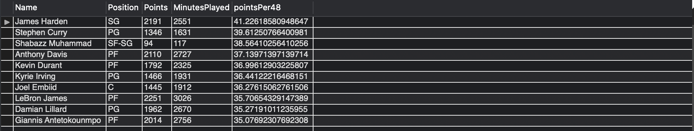

# Term_DE1  

## Project Description 

### OPERATIONAL LAYER: 

The data includes National Basketball Association (NBA) statistics for players, teams and coaches for 2017-2018 season. The relational database can be seen below. 

CSV files were used to store the raw data. Then a schema and tables were created with the same attributes as the CSV files. Finally, the data was inserted into MySQL using the following command 

LOAD DATA 
LOCAL INFILE 'path_to_csv_file'
INTO TABLE 'corresponding_table'
FIELDS TERMINATED BY ','
LINES TERMINATED BY '\r\n'
IGNORE 1 LINES 

### ANALYTICAL LAYER: 
After the tables were loaded to MySQL, the analytical data layer was established. In order to enable multi-level Two data marts were created, using events which re-create the data marts every minute for an hour and record the times of creation to a table called “messages”   

1. Team_Coach_Analytic: includes information about teams such as the Franchise name, name abbreviation, city/state and the coach. In addition, it includes both defensive and offensive statistics. 
1. Players_Analytic: includes the players’ attributes such as name, age, position and franchise as well as individual performance metrics like games played.

By creating views from the above data marts, we can potentially answer the following question. 

### POTENTIAL ANALYTICS:  

#### Team Level 

* Question 1: Who are the top 10 defensive coaches (ordered by steals)
* Question 2: Who are the top 10 coaches that rely on three point shots the most 
* Question 3: What are the top ten teams with the highest field goal attempts (FGA), in order from highest to lowest? 
* Question 4: What are the top ten teams with the highest effective field goal percentages (EFG%) and how it compares to simple Field Goal %?  
* Question 5: Which teams’ assists on field goals percentage is more than 50%?
* Question 6: How often did each team foul their opponent, on average? 

#### Individual Level 

* Question 1: Which players averaged over 25 points per game? 
* Question 2: How many players averaged between 10 and 20 points per game?
* Question 3: Who was the most time (48 minutes) efficient scorer in the league? 
* Question 4: What players played less than or equal to half the season but scored over 15 points a game? 

### DATA MART: 

The following queries result in views that provide answers to the questions listed above.

#### Team Level 

* Question 1: SELECT * FROM CoachesByDefence;

* Question 2: SELECT * FROM CoachesBy3PAttempt;

* Question 3: SELECT * FROM Top10FGA;

* Question 4: SELECT * FROM eFGtoFG; 

* Question 5: SELECT * FROM AssistOnFGRatio;

* Question 6: SELECT * FROM FoulPerGame; 

#### Individual Level 

* Question 1: SELECT * FROM TopPPG;

* Question 2: SELECT * FROM ScorersBtw10and20;

* Question 3: SELECT * FROM TopTimeEfficient;

* Question 4: SELECT * FROM HalfSeason15Points;

